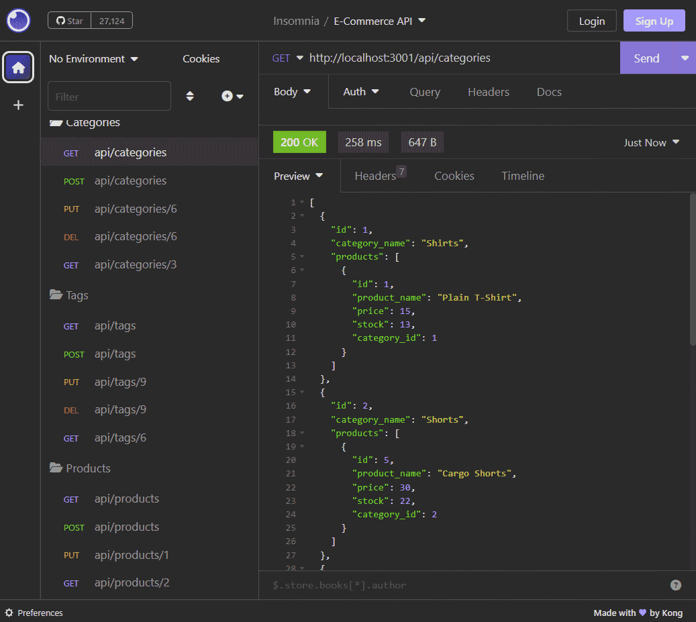

# E-Commerce Back End

## Description
A simple example API for an e-commerce back end written in [nodejs](https://nodejs.org/en) with [Express](https://expressjs.com/) and [MySQL](https://www.mysql.com/), using [Sequelize](https://sequelize.org/) for an [ORM](https://en.wikipedia.org/wiki/Object%E2%80%93relational_mapping).  This application has no front end, but requests can be sent to the server from an API explorer tool like [Insomnia](https://insomnia.rest/).  
**Screencast: [Testing E-Commerce Back End API with Insomnia](https://watch.screencastify.com/v/krGglumGEivF8JqQPhSD)**
## Installation
1. Clone this repository: `git clone git@github.com:kitrath/e-commerce-back-end`
2. Navigate to the base directory: `cd e-commerce-back-end`
3. Install dependencies: `npm install`
4. Create a `.env` file in the base directory.  Provide your database connection information (see [./config/connection.js](config/connection.js)).
4. Create the database. Log in to the mysql cli client with `mysql -u <username> -p`, then `source db/schema.sql`.
5. Seed the database: `npm run seed`.

## Usage
Start the API server with `npm start`. The server serves on `http://localhost:3001`. Exercise the API with a desktop API explorer tool like [Insomnia](https://insomnia.rest/). Stop the API server with `CTRL-C`.  
The 3 API *entities* are [category](./models/Category.js), [product](./models/Product.js), and [tag](./models/Tag.js`). `GET` and `POST` methods available on `/api/categories`, `/api/tags`, and `/api/products`.  `GET`, `PUT`, and `DELETE` methods available on `/api/categories/{id}`, `/api/tags/{id}`, and `/api/products/{id}`.  `PUT` and `POST` methods require a JSON request body comprised of a JSON object (see comments in [/routes/api](./routes/api) files corresponding to each API entity).

*Example*: 
- HTTP Method: `GET`
- URL: `http://localhost:3001/api/products/4`
- RESULT: *Returns a single product (with id 4), with its corresponding tags.*

## Screenshot
Calling the API from *[Insomnia](https://insomnia.rest/)*

